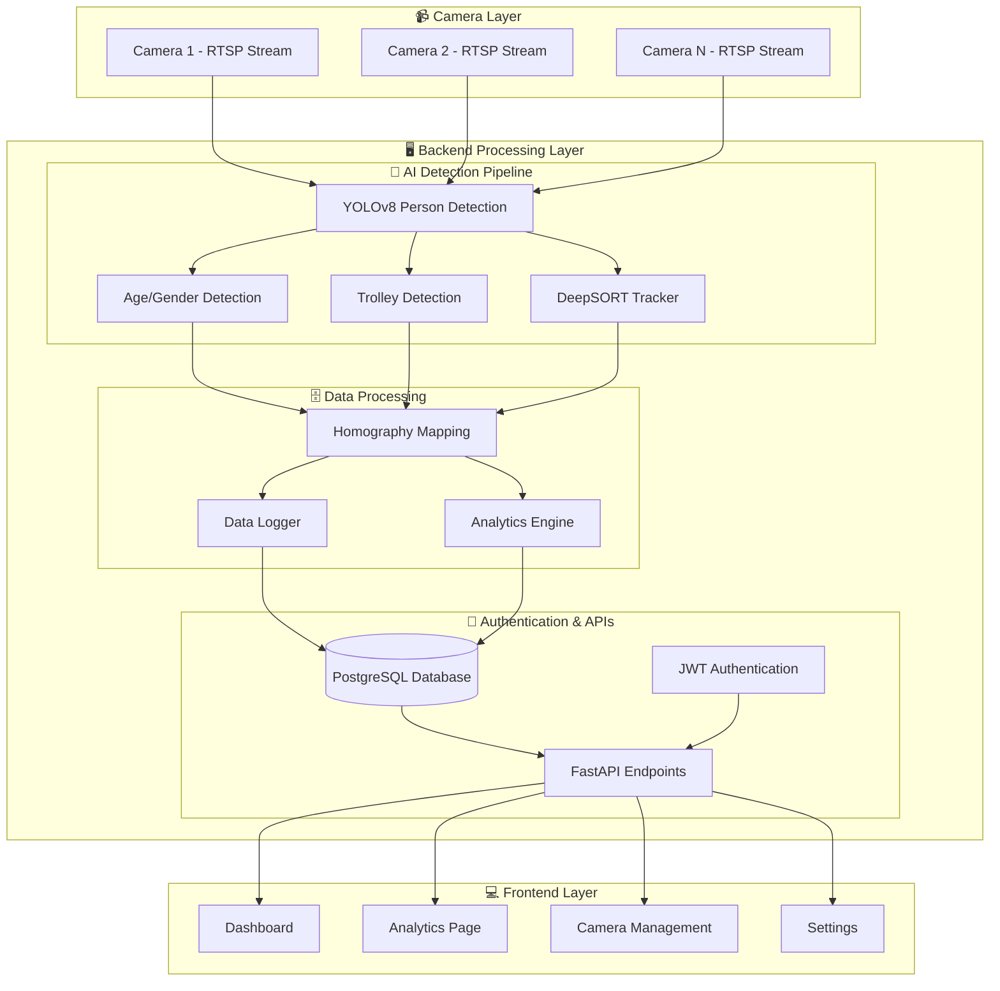
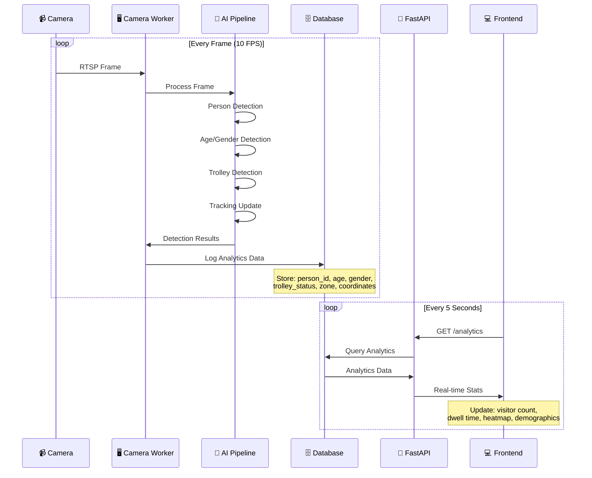
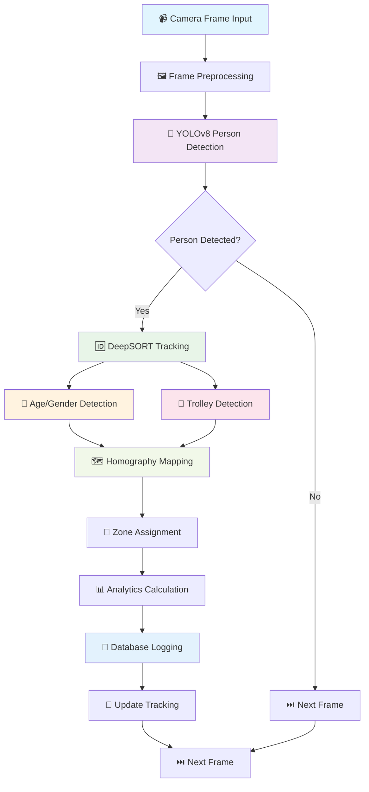
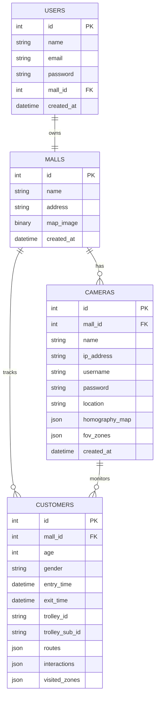
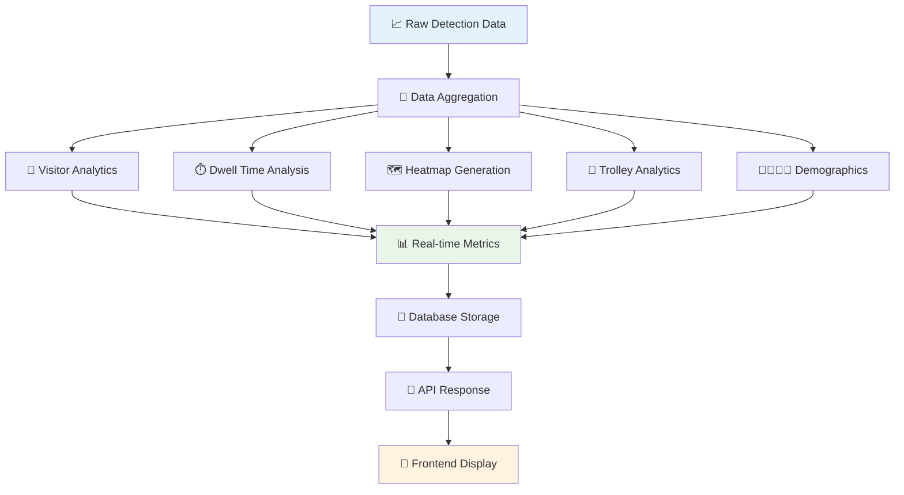
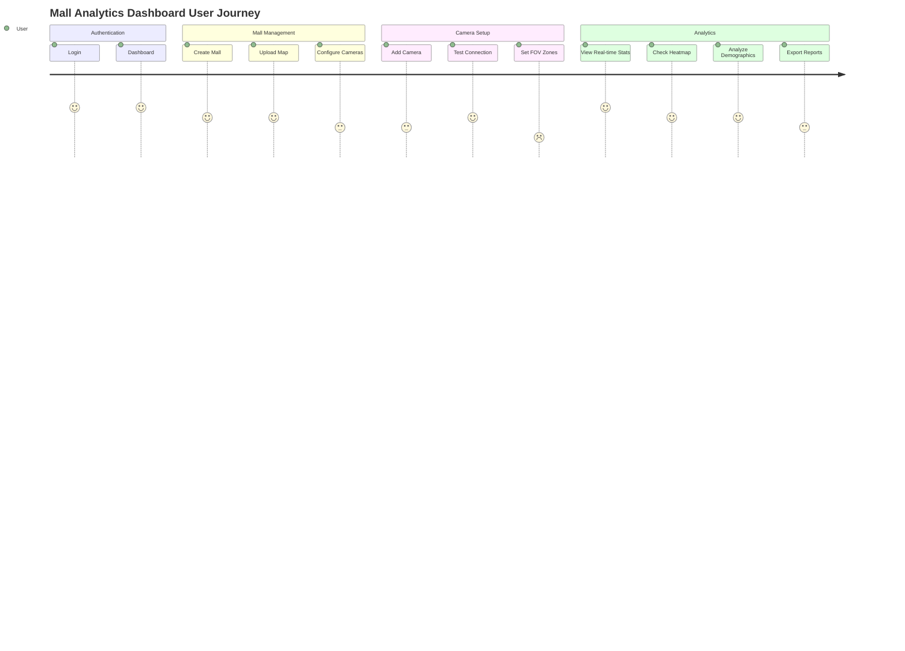
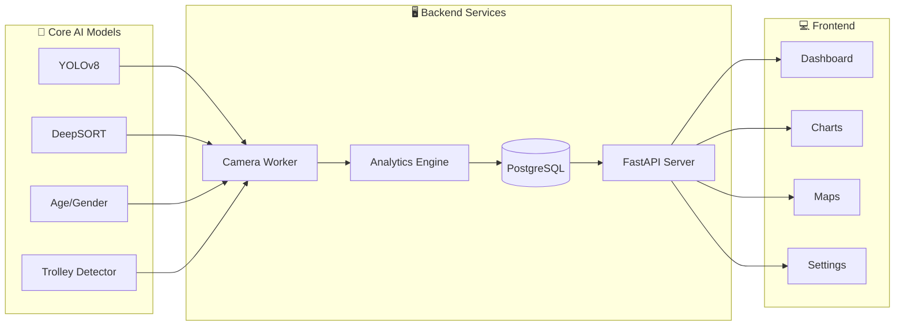
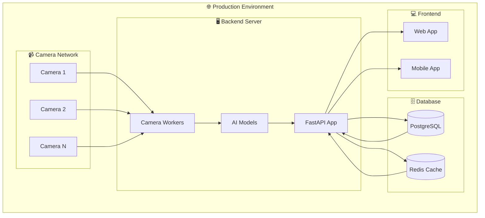

# 🏢 Mall Analytics System - Complete Workflow Diagram

## 📊 System Architecture Overview



## 🔄 Real-Time Data Flow



## 🎯 AI Detection Pipeline Workflow



## 🗄️ Database Schema Workflow



## 🔐 Authentication & API Workflow

```mermaid
flowchart LR
    subgraph "🔐 Authentication Flow"
        A[👤 User Login] --> B[🔑 JWT Token Generation]
        B --> C[📝 Token Storage]
        C --> D[🔒 API Request with Token]
        D --> E[✅ Token Validation]
        E --> F[📊 Data Access]
    end
    
    subgraph "🔌 API Endpoints"
        G[/auth/login] --> H[/auth/signup]
        I[/mall/create] --> J[/mall/{id}]
        K[/camera/add] --> L[/camera/{id}/live]
        M[/analytics] --> N[/customer/track]
    end
    
    F --> G
    F --> I
    F --> K
    F --> M
```

## 📊 Analytics Processing Workflow



## 🎨 Frontend User Journey



## 🔧 System Components Integration



## 🚀 Deployment Architecture



## 📋 Key Workflow Features

### 🔄 **Real-time Processing**
- **10 FPS** frame processing
- **Live analytics** updates every 5 seconds
- **Background workers** for each camera
- **Automatic cleanup** of inactive connections

### 🎯 **AI Pipeline**
- **Multi-stage detection**: Person → Age/Gender → Trolley → Tracking
- **Homography mapping**: Camera coordinates to mall map
- **Zone-based analytics**: FOV zone tracking
- **Route analysis**: Customer path tracking

### 📊 **Analytics Engine**
- **Real-time metrics**: Visitor count, dwell time, demographics
- **Heatmap generation**: Zone popularity visualization
- **Trolley analytics**: Shopping behavior insights
- **Historical data**: Trend analysis and reporting

### 🔐 **Security & Performance**
- **JWT authentication**: Secure API access
- **Connection pooling**: Database optimization
- **Error handling**: Graceful failure recovery
- **Caching**: Redis for performance

This workflow diagram shows the complete end-to-end system from camera input to frontend analytics display, highlighting all the key components and data flows in your mall analytics platform. 